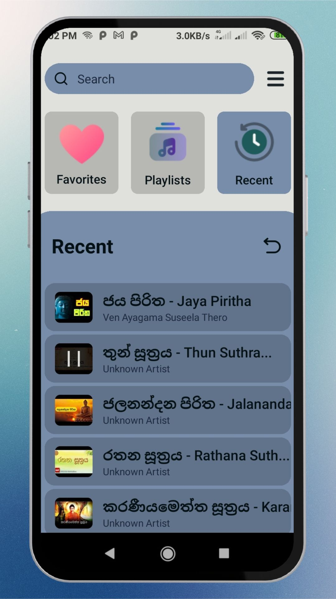

# **Pirith Chanting App** 🎶

Welcome to the **Pirith Chanting App**, an online streaming platform for calming and spiritually uplifting *Pirith* chants. Access a curated collection of chants that bring peace and mindfulness, now available anytime through our app.

---

## **Features**

- **Extensive Collection of Pirith Chants**  
  Stream various revered *Pirith* chants like *Ratana Sutta*, *Karaniya Metta Sutta*, *Maha Mangala Sutta*, and many more.

- **Seamless Online Streaming**  
  High-quality streaming directly from our app. Simply connect to the internet and start listening.

- **YouTube Integration**  
  Our app uses the YouTube API to bring you these chants, providing a smooth streaming experience. *(Note: YouTube Unlimited Data packages may cover streaming, though other data charges may apply for app resources)*

- **User-Friendly Interface**  
  Simple, easy-to-navigate design for quick access to your favorite chants.

---

## **App Screenshots** 📱
 
Here’s a preview of the app’s look and feel:

| Screenshot 1 | Screenshot 2 | Screenshot 3 | Screenshot 4 |
|--------------|--------------|--------------|--------------|
|  |  |  |  |

| Screenshot 5 | Screenshot 6 | Screenshot 7 | Screenshot 8 |
|--------------|--------------|--------------|--------------|
|  |  |  |  |

---

## **Available Pirith Chants** 📜

- **Ratana Sutta** (*රතන සුත්‍රය*)
- **Karaniya Metta Sutta** (*කරණීය මෙත්ත සුත්‍රය*)
- **Maha Mangala Sutta** (*මහා මංගල සුත්‍රය*)
- **Dhajagga Sutta** (*ධජග්ග සුත්‍රය*)
- **Atanatiya Sutta** (*අටා​නාටි‍ය සුත්‍රය*)
- **Girimananda Sutta** (*ගිරිමානන්ද සුත්‍රය*)
- **Bojjhanga Sutta** (*බොජ්ඣංග සුත්‍රය*)

...and many more!

---

## **Technical Information**

- **Platform:** Android
- **Requirements:** Active internet connection for streaming
- **Permissions Required:** Internet access for streaming functionality

---

## **Privacy and Data Usage**

This app uses **Async Storage** to store minimal user preferences locally on your device. No personal data is collected, stored, or shared by our app.

---

## **Installation**

To use this app:

1. Clone or download the repository.
2. Install the app package on your Android device.
3. Open the app, connect to the internet, and enjoy the soothing chants!

---

## **Future Plans**

Our plans include:
- Expanding the library with more *Pirith* chants
- Improving UI/UX for a better user experience
- Adding offline features based on user demand
- Adding background play feture

---

## **Contact Us**

For any issues, feedback, or suggestions, feel free to [open an issue](https://github.com/Pirith-mobile-app/issues) or reach out via email at [isharamadushankab@gmail.com].

---

## **Contributing**

We welcome contributions! If you'd like to contribute to this project, please fork the repository, create a new branch, make your changes, and submit a pull request.

---

## **License**

This project is licensed under the MIT License - see the [LICENSE](LICENSE) file for details.

---

**Start your journey to mindfulness and spiritual well-being with our *Pirith Chanting App* today!**
